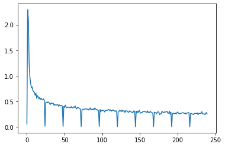
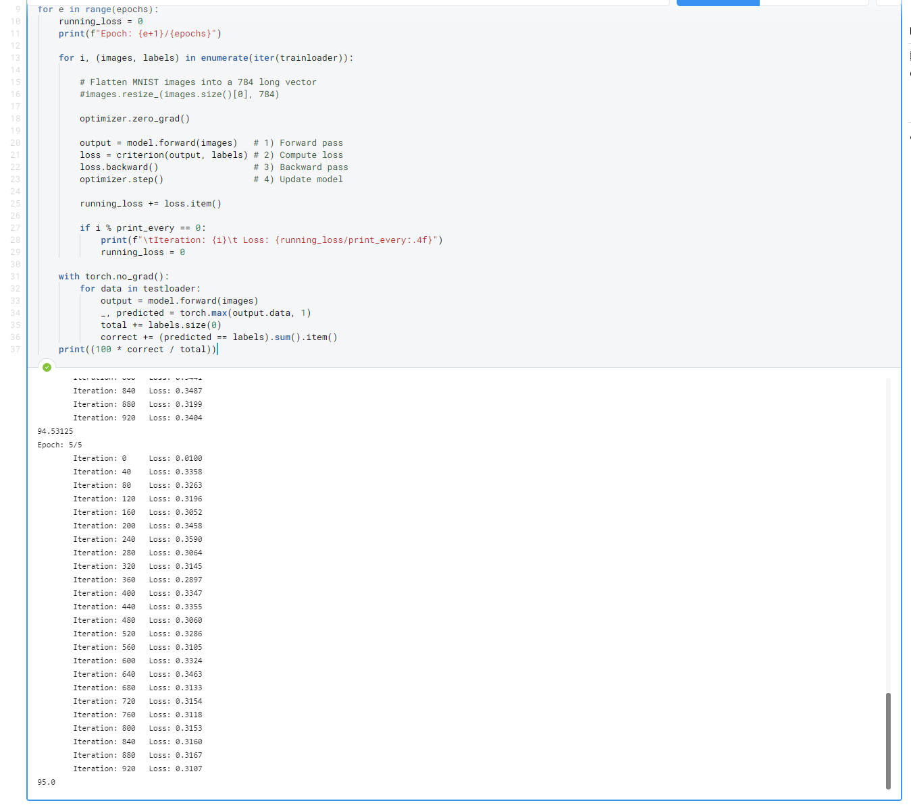

# Hello!
This is a fashion MNIST dataset analysis performed by team Pull & Bear :smiley:

### Team members:
>[Aderemi Fayoyiwa](https://github.com/AderemiF)
>[Bence Kovacs](https://github.com/kovacsbelsen)
>[Luca Pianta](https://github.com/lpianta)
>[Saurabh Satasia](https://github.com/saurabhsatasia)
>[Michał Podlaszuk](https://github.com/MichalPodlaszuk)

## Table of contents
* [Problem description](#problem-description)
* [Loss graph](#loss-graph)
* [Setup](#setup)
* [Features](#features)
* [Status](#status)
* [Inspiration](#inspiration)
* [Contact](#contact)

## Problem description
Fashion MNIST dataset is a set of 70000 28x28 images of clothes.

Our main goals:
* Create a neural network that correctly classifies which cloth type are we dealing with :smirk:
* Make this neural network as good as possible :sunglasses:
* Learn more about Deep Learning :grin:

## Loss graph

We can see here that our CNN improves drastically over 1st epoch, we could reduce number of epochs and save computational time!

## Result we got

Which is a whopping 95% accuracy!